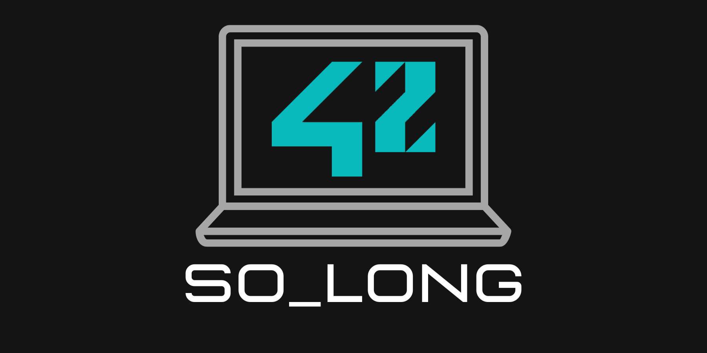

<br>
<br>
<br>

> Not the best way, but it works !

<br>
<br>

# So_Long

- Un projet de jeu 2D simple en C

## Index 
- [Introduction](#introduction)
- [Objectif](#objectif)
- [Aperçu du projet](#aperçu-du-projet)
- [Fonctionnalités clés](#fonctionnalités-clés)
- [Éléments du jeu](#éléments-du-jeu)
- [Contrôles](#contrôles)
- [Structure du code](#structure-du-code)
- [Compilation et exécution](#compilation-et-exécution)
- [Captures d'écran](#captures-décran)
- [Résultat](#résultat)
- [Ressources](#ressources)

<br>

## Introduction
Bienvenue dans So_Long, un projet de jeu 2D développé en C dans le cadre d'un programme d'apprentissage de la programmation. Ce projet se concentre sur la création d'un jeu simple en utilisant la bibliothèque graphique MinilibX. L'objectif est de construire un jeu où un joueur se déplace à travers une carte, collecte des objets, évite des obstacles et atteint la sortie.

<br>
<br>

## Objectif
L'objectif principal du projet So_Long est de mettre en œuvre un jeu de base en utilisant C et la bibliothèque MinilibX. Le jeu implique la gestion des entrées utilisateur, le rendu graphique et la gestion des éléments du jeu tels que le joueur, les objets, les obstacles et la sortie.

<br>
<br>

## Aperçu du projet
So_Long est un jeu basé sur un labyrinthe où le joueur se déplace à travers une carte représentée par une grille. La carte contient divers éléments, notamment le joueur, des objets collectibles, des obstacles et une sortie. La tâche du joueur est de collecter tous les objets et d'atteindre la sortie tout en évitant les obstacles.

<br>
<br>

## Fonctionnalités clés
Mouvement du joueur : Utilisez les touches fléchées (haut, bas, gauche, droite) pour déplacer le joueur.
Collection d'objets : Collectez des objets représentés par des symboles spécifiques sur la carte.
Sortie : Atteignez la sortie pour terminer le jeu.
Évitement d'obstacles : Déplacez-vous autour des obstacles représentés par des symboles spécifiques.
Graphismes : Graphismes 2D simples implémentés à l'aide de la bibliothèque MinilibX.

<br>
<br>

## Éléments du jeu
Le jeu comprend les éléments suivants :

Joueur (P) : Le personnage principal contrôlé par le joueur.
Objet (C) : Objets collectibles que le joueur doit récupérer.
Killer (x) : Obstacles que le joueur doit éviter.
Mur (1) : Murs solides qui restreignent le mouvement.
Sol (0) : Espaces ouverts où le joueur peut se déplacer.
Sortie (E) : L'objectif pour le joueur.

<br>
<br>

## Contrôles
Touches fléchées : Déplacer le joueur dans la direction correspondante.
W, A, S, D : Touches alternatives pour le mouvement (haut, gauche, bas, droite).
Touche ESC : Quitter le jeu.

<br>
<br>

## Structure du code
Le projet est structuré comme suit :

- Fichier d'en-tête (so_long.h) : Contient les prototypes de fonctions, les macros et la définition de la structure du jeu.
- Fichiers source : Code modulaire avec des fichiers séparés pour l'analyse, le dessin, la gestion des événements clés et la logique du jeu.
- Bibliothèque MinilibX : Utilisée pour le rendu graphique.

<br>
<br>

## Compilation et exécution
Pour compiler le projet, exécutez les commandes suivantes :

```
git clone https://github.com/aceyzz/So_long.git
cd So_long/so_long
make
./so_long "maps/example_map.ber"
```

*Remarque : Remplacez "example_map.ber" par le chemin de votre fichier de carte souhaité. (voir fichier so_long/maps/index_maps)*

<br>
<br>

## Captures d'écran

<div style="display: grid; grid-template-columns: repeat(3, 1fr); gap: 20px;">
	
	
	
	<div style="display: grid; grid-template-columns: repeat(1, 2fr); gap: 10px;">
		
		
	</div>
	
	
</div>

<br>
<br>

## Résultat


<br>
<br>

## Ressources
Documentation [MinilibX](https://harm-smits.github.io/42docs/libs/minilibx/getting_started.html)

