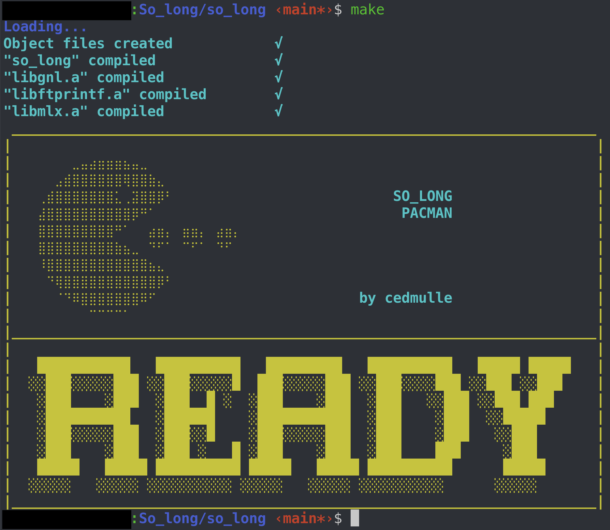
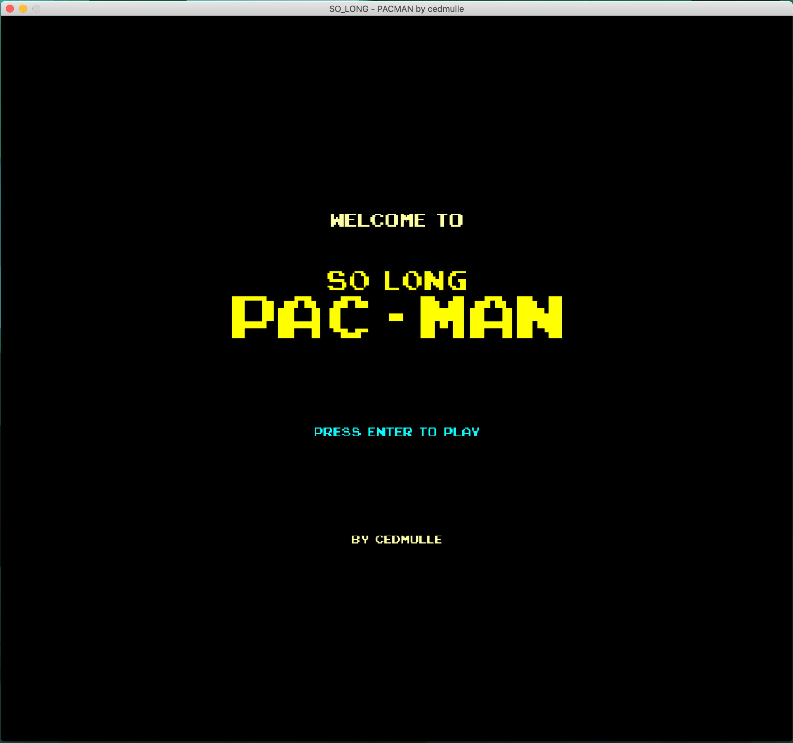
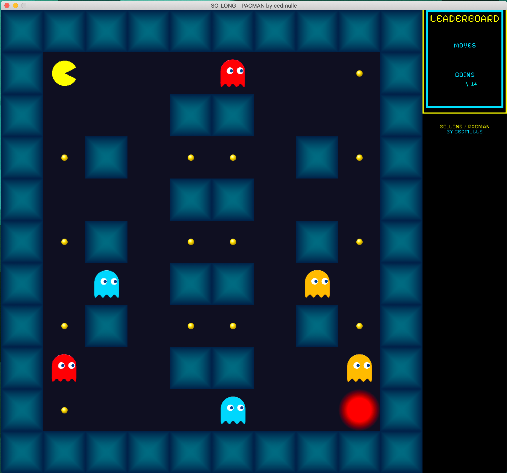
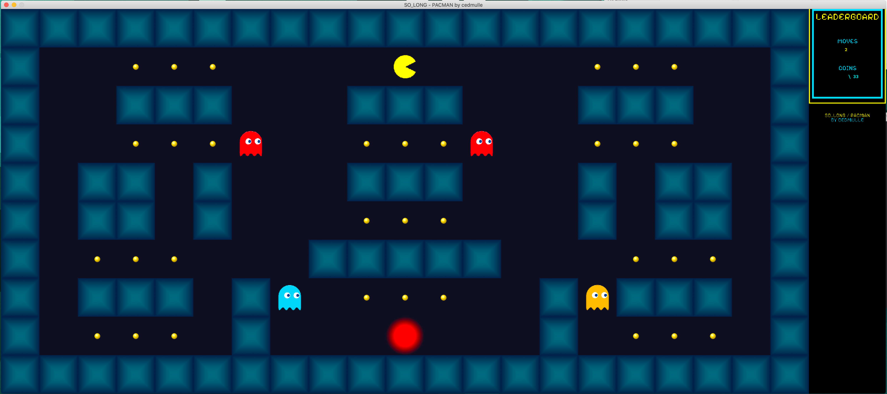
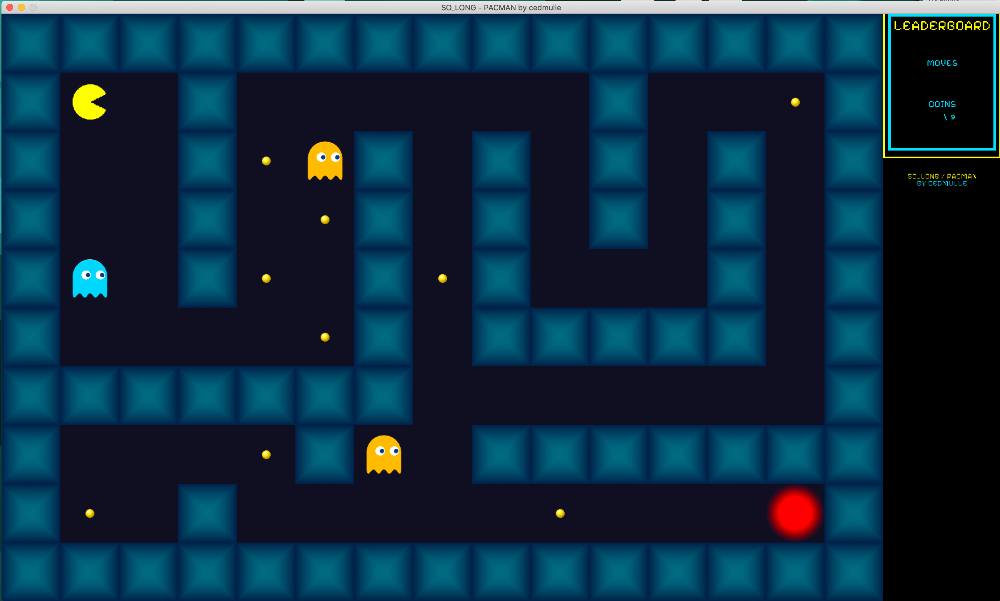
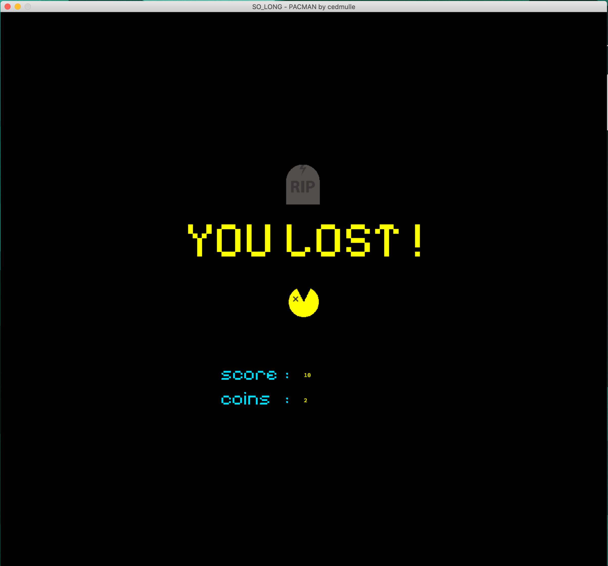
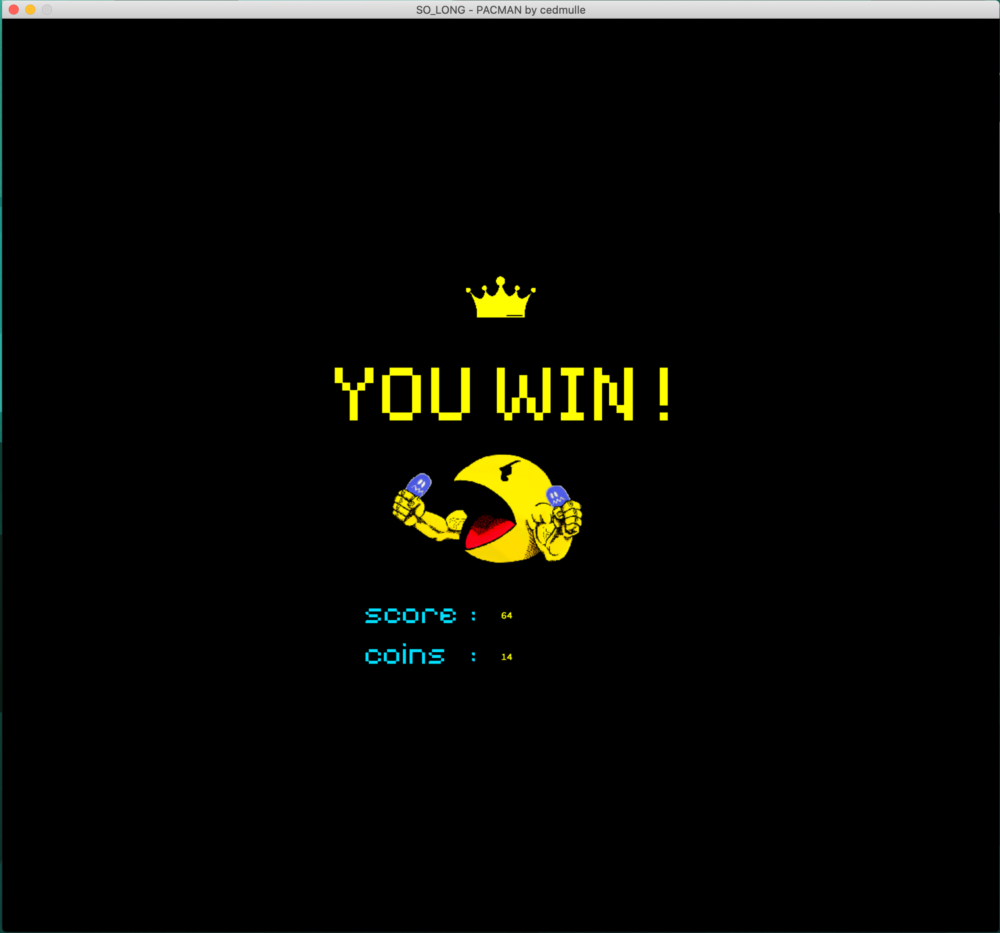

<br>

# So_Long

- Un projet de jeu 2D simple en C, à l'aide la lib. Minilibx de 42.

## Index 
- [Introduction](#introduction)
- [Objectif](#objectif)
- [Aperçu du projet](#aperçu-du-projet)
- [Fonctionnalités clés](#fonctionnalités-clés)
- [Éléments du jeu](#éléments-du-jeu)
- [Contrôles](#contrôles)
- [Structure du code](#structure-du-code)
- [En détail](#en-détail)
	- [Structure](#structure-t_game)
	- [Fichiers sources](#fichiers-sources)
	- [Fonctions de la Minilibx](#fonctions-de-la-minilibx-utilisées)
	- [Procédé](#procédé)
- [Compilation et exécution](#compilation-et-exécution)
- [Captures d'écran](#captures-décran)
- [Résultat](#résultat)
- [Ressources](#ressources)

<br>

## Introduction
Bienvenue dans So_Long, un projet de jeu 2D développé en C dans le cadre d'un programme d'apprentissage de la programmation. Ce projet se concentre sur la création d'un jeu simple en utilisant la bibliothèque graphique MinilibX. L'objectif est de construire un jeu où un joueur se déplace à travers une carte, collecte des objets, évite des obstacles et atteint la sortie.

<br>
<br>

## Objectif
L'objectif principal du projet So_Long est de mettre en œuvre un jeu de base en utilisant C et la bibliothèque MinilibX. Le jeu implique la gestion des entrées utilisateur, le rendu graphique et la gestion des éléments du jeu tels que le joueur, les objets, les obstacles et la sortie.

<br>
<br>

## Aperçu du projet
So_Long est un jeu basé sur un labyrinthe où le joueur se déplace à travers une carte représentée par une grille. La carte contient divers éléments, notamment le joueur, des objets collectibles, des obstacles et une sortie. La tâche du joueur est de collecter tous les objets et d'atteindre la sortie tout en évitant les obstacles.

<br>
<br>

## Fonctionnalités clés
Mouvement du joueur : Utilisez les touches fléchées (haut, bas, gauche, droite) pour déplacer le joueur.
Collection d'objets : Collectez des objets représentés par des symboles spécifiques sur la carte.
Sortie : Atteignez la sortie pour terminer le jeu.
Évitement d'obstacles : Déplacez-vous autour des obstacles représentés par des symboles spécifiques.
Graphismes : Graphismes 2D simples implémentés à l'aide de la bibliothèque MinilibX.

<br>
<br>

## Éléments du jeu
Le jeu comprend les éléments suivants :

Joueur (P) : Le personnage principal contrôlé par le joueur.
Objet (C) : Objets collectibles que le joueur doit récupérer.
Killer (x) : Obstacles que le joueur doit éviter.
Mur (1) : Murs solides qui restreignent le mouvement.
Sol (0) : Espaces ouverts où le joueur peut se déplacer.
Sortie (E) : L'objectif pour le joueur.

<br>
<br>

## Contrôles
Touches fléchées : Déplacer le joueur dans la direction correspondante.
W, A, S, D : Touches alternatives pour le mouvement (haut, gauche, bas, droite).
Touche ESC : Quitter le jeu.

<br>
<br>

## Structure du code
Le projet est structuré comme suit :

- Fichier d'en-tête (so_long.h) : Contient les prototypes de fonctions, les macros et la définition de la structure du jeu.
- Fichiers source : Code modulaire avec des fichiers séparés pour l'analyse, le dessin, la gestion des événements clés et la logique du jeu.
- Bibliothèque MinilibX : Utilisée pour le rendu graphique.

<br>
<br>

## En détail

### Structure ```t_game```

```
typedef struct s_game
{
	int		fd;                 // File descriptor for the map file
	char	**map;              // 2D array representing the game map
	char	**map_copy;         // Copy of the game map
	char	*name_map;          // Name of the map file
	int		x;                  // Width of the game map
	int		y;                  // Height of the game map
	int		pl_x;               // Player's current x-coordinate
	int		pl_y;               // Player's current y-coordinate
	int		exit_x;             // Exit's x-coordinate
	int		exit_y;             // Exit's y-coordinate
	int		path_start[2];      // Starting point of the pathfinding algorithm
	int		path_end[2];        // Ending point of the pathfinding algorithm
	int		max_coin;           // Maximum number of coins in the game
	int		coin;               // Current number of coins in the game
	int		coin_collected;     // Number of coins collected by the player
	int		started;            // Flag indicating if the game has started
	void	*mlx;               // Pointer to the MLX structure
	void	*win;               // Pointer to the game window
	void	*img;               // Pointer to the game image
	int		*addr;              // Address of the game image data
	int		bpp;                // Number of bits per pixel
	int		line_len;           // Length of each image line in bytes
	int		endian;             // Endianness of the image data
	int		size;               // Size of the game image in bytes
	int		window_width;       // Width of the game window
	int		window_height;      // Height of the game window
	int		image_width;        // Width of the game image
	int		image_height;       // Height of the game image
	int		x_offset;           // X-offset for rendering the game image
	int		y_offset;           // Y-offset for rendering the game image
	int		moves;              // Number of moves made by the player
	int		finished;           // Flag indicating if the game has finished
	int		nb_killers;         // Number of killer enemies in the game
	int		**tab_killers;      // 2D array representing the killer enemies
	void	*img_plup;          // Pointer to the player's image facing up
	void	*img_pldo;          // Pointer to the player's image facing down
	void	*img_plri;          // Pointer to the player's image facing right
	void	*img_plle;          // Pointer to the player's image facing left
	void	*img_kil1;          // Pointer to the killer enemy's image variant 1
	void	*img_kil2;          // Pointer to the killer enemy's image variant 2
	void	*img_kil3;          // Pointer to the killer enemy's image variant 3
	void	*img_floo;          // Pointer to the floor tile image
	void	*img_wall;          // Pointer to the wall tile image
	void	*img_item;          // Pointer to the coin item image
	void	*img_exop;          // Pointer to the exit open image
	void	*img_excl;          // Pointer to the exit closed image
	void	*img_boar;          // Pointer to the game over board image
	void	*img_swin;          // Pointer to the game win board image
	void	*img_lose;          // Pointer to the game lose board image
	void	*img_load;          // Pointer to the loading screen image
} 				t_game;
```

<br>
<br>

---

### Fichiers sources

- ft_free.c
```
static void free_tab(char **tab);
static void free_killers(t_game *game);		
int ft_free_info(t_game *info);
```

- ft_utils.c
```
char *ft_itoa(int nb);
int ft_error(int error);
void create_tab_killers(t_game *game);
```

- img_board.c
```
void print_final_score(t_game *game);
void draw_move_board(t_game *game);
void draw_coin_board(t_game *game);
void draw_coin_board_max(t_game *game);
```

- img_drawer.c
```
void draw_map(t_game *game, char direction);
```

- img_handler.c
```
void set_images(t_game *game);
void images_cleaner(t_game *game);
```

- keypress.c
```
int handle_keypress(int keycode, t_game *game);
```

- main.c
```
static int init_args(t_game *info, char *av);
int main(int argc, char *argv[]);
```

- map_parser.c
```
static int get_size(t_game *info);
static int is_valid_charac(t_game *info, int i, int j);
static int is_valid_map(t_game *info, int p, int c, int e);
static int path_ok(int y, int x, int *coin, t_game *info);
int parse_map(t_game *info);
```

- move_killers.c
```
void move_all_killers(t_game *game);
```

- move_player.c
```
void move_player(int keycode, t_game *game);
```

- win_creator.c
```
static void ending_screen(t_game *game, int result);
static void loading_screen(t_game *game);
void finish_game(t_game *game, int result);
void launch_screen(t_game *game);
```

<br>

---


### Fonctions de la Minilibx utilisées
```
mlx_init():
```
Initialise une connexion avec le serveur graphique X.
Alloue la mémoire nécessaire et initialise une structure qui stocke des informations sur la connexion graphique.

```
mlx_new_window():
```
Crée une nouvelle fenêtre graphique.
Prend comme paramètres la connexion graphique initialisée avec mlx_init(), les dimensions de la fenêtre, et le titre de la fenêtre. Retourne un identifiant unique pour la fenêtre.

```
mlx_new_image():
```
Crée une nouvelle image en mémoire.
Prend comme paramètres la connexion graphique et les dimensions de l'image. Retourne un identifiant unique pour l'image.

```
mlx_get_data_addr():
```
Obtient l'adresse du premier octet de l'image.
Prend comme paramètres l'identifiant de l'image, un pointeur vers la variable qui stockera l'adresse, et des variables pour les informations sur la largeur, la hauteur, et les bits par pixel.

```
mlx_hook():
```
Associe une fonction à un événement, comme une touche pressée.
Prend comme paramètres l'identifiant de la fenêtre, le type d'événement, une fonction à appeler, et un paramètre qui sera passé à la fonction.

```
mlx_put_image_to_window():
```
Affiche une image dans une fenêtre.
Prend comme paramètres la connexion graphique, l'identifiant de la fenêtre, l'identifiant de l'image, et les coordonnées où afficher l'image.

```
mlx_destroy_image():
```
Détruit une image précédemment créée.
Prend comme paramètres la connexion graphique et l'identifiant de l'image à détruire.

```
mlx_destroy_window():
```
Ferme une fenêtre graphique.
Prend comme paramètres la connexion graphique et l'identifiant de la fenêtre à fermer.

```
mlx_loop():
```
Lance la boucle principale de gestion des événements graphiques.
Boucle infinie qui gère les événements tels que les touches pressées.

<br>
<br>

---

### Procédé

1. Inclusions de bibliothèques
Le programme utilise plusieurs bibliothèques standard telles que ```<unistd.h>```, ```<stdlib.h>```, ```<fcntl.h>```, ```<math.h>```, ainsi que des bibliothèques tierces telles que ```"get_next_line/get_next_line.h"```, ```"ft_printf/ft_printf.h"```, et ```"../inc/mlx/mlx.h"```. Ces inclusions fournissent des fonctionnalités de base, des entrées/sorties, des fonctions mathématiques, et des outils pour l'interface graphique avec la MiniLibX.

<br>

2. Définition des constantes
Le fichier d'en-tête définit un ensemble de constantes représentant différents éléments du jeu, tels que le joueur, les objets, les murs, le sol, la sortie, etc. Ces constantes facilitent la lecture et la compréhension du code en remplaçant les valeurs numériques par des noms significatifs.

<br>

3. Structure de données
Le programme utilise une structure appelée ```t_game``` pour stocker diverses informations sur l'état du jeu. Cette structure contient des membres tels que des tableaux pour stocker la carte du jeu, des variables pour suivre la position du joueur, des compteurs pour les objets collectés, des gestionnaires pour l'interface graphique (MiniLibX), et d'autres informations relatives au jeu.

<br>

4. Gestion des touches
La fonction ```handle_keypress``` est appelée en réponse à l'appui sur une touche. Elle traite les événements clavier, déclenche des actions en fonction de la touche pressée, et met à jour l'état du jeu en conséquence.

<br>

5. Analyse de la carte
La fonction parse_map est responsable de l'analyse de la carte du jeu à partir d'un fichier. Elle extrait les informations nécessaires et initialise la structure ```t_game``` en conséquence.

<br>

6. Initialisation de l'interface graphique
La fonction ```launch_screen``` initialise l'interface graphique en utilisant la MiniLibX. Elle crée la fenêtre, charge les images nécessaires, et prépare le terrain de jeu initial.

<br>

7. Boucle principale du jeu
La boucle principale du jeu gère le déroulement du jeu. Elle surveille les événements (y compris les touches pressées), met à jour l'état du jeu, dessine la carte, et réagit aux actions du joueur.

<br>

8. Mouvement du joueur
La fonction move_player est appelée pour déplacer le joueur en fonction de la touche pressée. Elle vérifie la validité du mouvement, met à jour les coordonnées du joueur, et effectue d'autres actions nécessaires.

<br>

9. Gestion des ennemis
Le programme inclut une fonction ```move_all_killers``` pour déplacer les ennemis (désignés comme "```killers```") sur la carte.

<br>

10. Gestion de l'affichage
Plusieurs fonctions sont dédiées à la gestion de l'affichage, notamment la fonction ```draw_map``` qui dessine la carte du jeu. (voir fichier drawing.c).

<br>

11. Gestion de la mémoire
Le fichier ft_free.c contient des fonctions pour libérer la mémoire allouée dynamiquement pendant l'exécution du programme, assurant une gestion propre des ressources.

<br>

12. Fin du jeu
La fonction ```finish_game``` est responsable de la gestion de la fin du jeu, indiquant si le joueur a gagné ou perdu.

<br>

13. Détails graphiques
Le programme utilise la MiniLibX pour la gestion graphique, ce qui implique des manipulations d'images et des opérations sur les fenêtres.

<br>
<br>

## Compilation et exécution
Pour compiler le projet, exécutez les commandes suivantes :

```
git clone https://github.com/aceyzz/So_long.git
cd So_long/so_long
make
./so_long "maps/example_map.ber"
```

*Remarque : Remplacez "example_map.ber" par le chemin de votre fichier de carte souhaité. (voir fichier so_long/maps/index_maps)*

<br>
<br>

## Captures d'écran

<div style="display: grid; grid-template-columns: repeat(3, 1fr); gap: 20px;">
	
	
	
	<div style="display: grid; grid-template-columns: repeat(1, 2fr); gap: 10px;">
		
		
	</div>
	
	
</div>

<br>
<br>

## Résultat


<br>
<br>

## Ressources
Documentation [MinilibX](https://harm-smits.github.io/42docs/libs/minilibx/getting_started.html)

<br>
<br>
<br>


>DON'T COPY, LEARN. RTFM.
